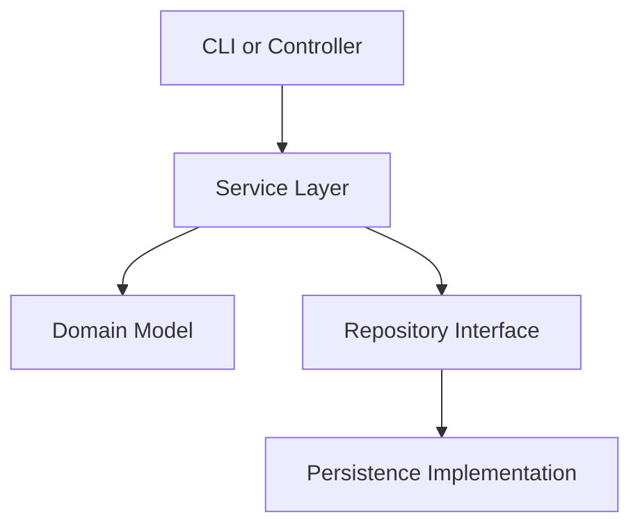
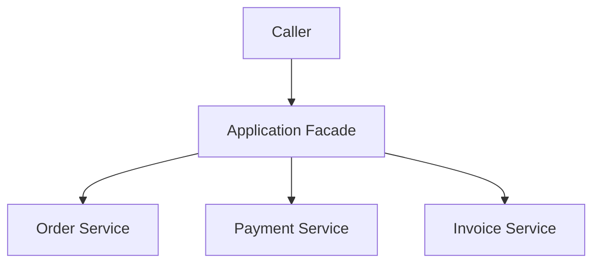
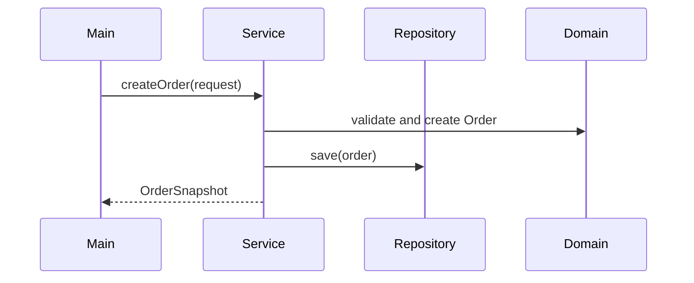
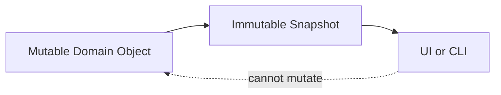

# Architecture Diagrams and Mermaid Examples

## Learning goals

- Use simple diagrams to explain Java architecture.
- Draw layered, facade, repository, and DTO boundaries.
- Keep diagrams useful instead of decorative.

## Why diagrams matter

Architecture diagrams help readers understand call direction and responsibility. A small diagram can explain what several paragraphs would otherwise describe.

## Layered architecture

The service coordinates the workflow. The domain owns rules. The repository hides storage details.

## Facade over services

A facade gives callers one simple entry point while internal services remain focused.

## Service to repository

## DTO or snapshot boundary

## When to use diagrams

Use diagrams when the relationships between classes are harder to explain in a list. Skip them for tiny one-class examples.

## Common mistakes

- Drawing every class and making the diagram unreadable.
- Showing arrows in both directions without explanation.
- Using diagrams that do not match the code.
- Hiding unclear design behind a polished diagram.

## Mini exercises

1. Draw a layered diagram for an invoice application.
2. Draw a sequence diagram for account transfer.
3. Draw a snapshot boundary for a product report.

## Quick summary

Architecture diagrams are useful when they clarify responsibility and dependency direction.
