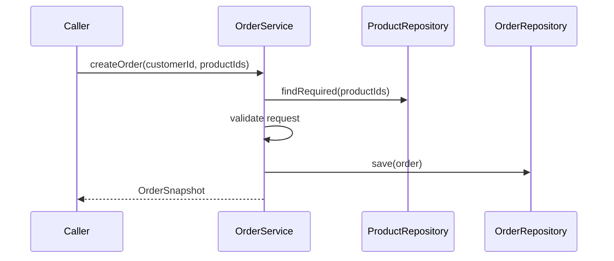
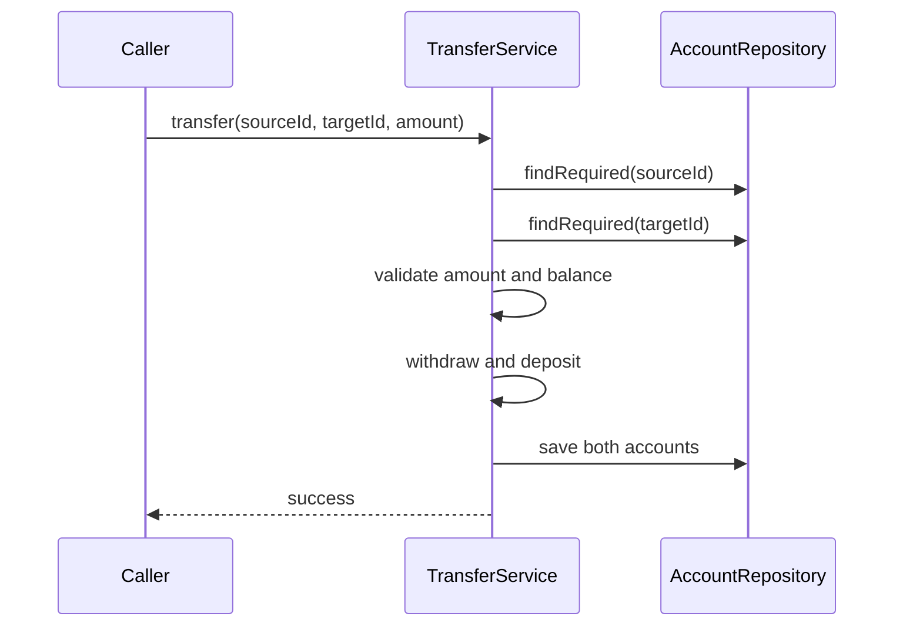
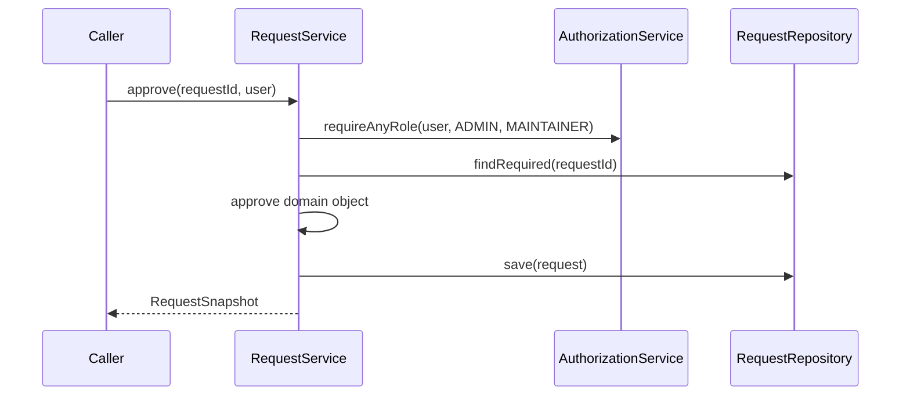
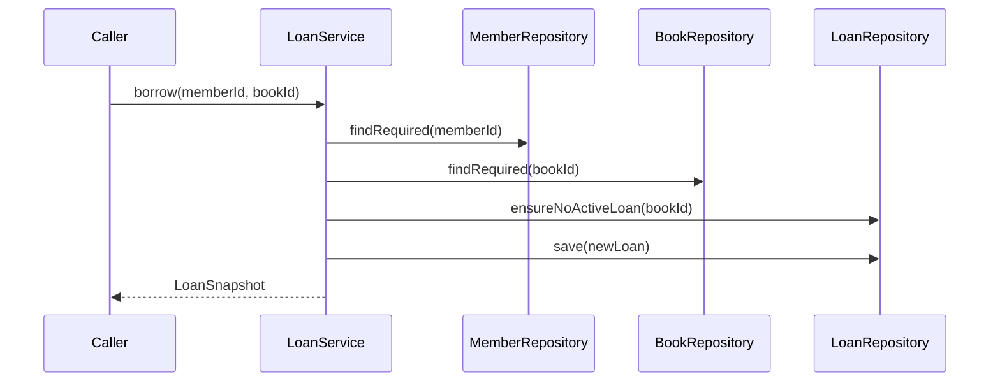

# Workflow Sequence Diagrams

## Learning goals

- Draw simple workflow sequence diagrams.
- Show service, repository, domain, and authorization interactions.
- Use diagrams to clarify all-or-nothing behavior.

## Create order

## Transfer money

## Approve request

## Borrow and return item

## Common mistakes

- Drawing repository calls before validation when validation should happen first.
- Hiding authorization from the diagram.
- Showing implementation details that do not help understand the workflow.

## Mini exercises

1. Draw a sequence diagram for invoice payment.
2. Add a failure path for unauthorized approval.
3. Add rollback behavior to a transfer diagram.

## Quick summary

Sequence diagrams show the order of calls and make workflow responsibility easier to discuss.
