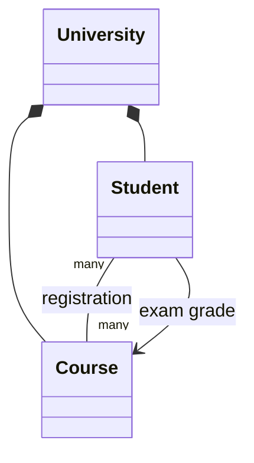

# Architecture

`University` is the public facade and root object for the in-memory model. It owns student and course records, assigns identifiers, manages registrations and exams, computes averages and rankings, and emits activity logs.

## Student and course model

Students receive progressive IDs beginning at `10000`; courses receive progressive codes beginning at `10`. The models remain private static classes inside `University` to keep this first OOP project compact. Fixed arrays preserve the course assignment limits, with explicit capacity checks replacing accidental array-overflow failures.

## Registration

Registration updates both the student's study plan and the course attendee list. Repeating the same registration is idempotent, so it cannot duplicate output or inflate ranking bonuses. Unknown IDs/codes and exceeded capacities produce clear exceptions.

## Exams and averages

An exam requires an existing registration and a grade from 0 through 30. Each student has one grade per course; recording it again updates both student and course grade views. Student and course averages are calculated from those synchronized records while preserving the original public string formats.

## Ranking

Eligible students have at least one recorded exam. Their score is:

`average grade + (exams taken / courses attended) * 10`

The highest three are returned. Equal scores are ordered by last name, first name, then student ID for deterministic output.

## Logging

The public `University.logger` retains the logger name `University`. Enrollment, activation, first registration, and every exam recording emit the original activity messages.
