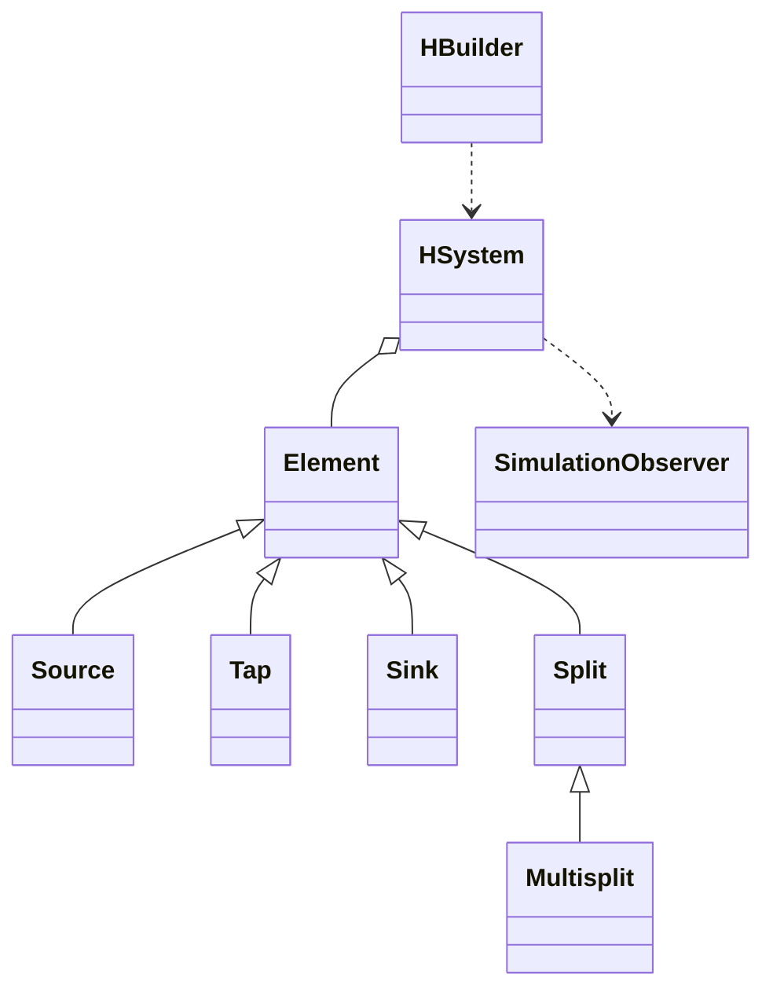

# Architecture

The simulator models a hydraulic network as connected objects in the `hydraulic` package. `Element` owns the common name, maximum-flow threshold, connection contract, and simulation interface. Concrete elements implement their own flow rule:

- `Source` starts a simulation with a configured flow.
- `Tap` passes or blocks its input.
- `Sink` terminates a branch.
- `Split` produces two equal output flows.
- `Multisplit` produces a configurable number of proportional flows.

## Simulation

`HSystem.simulate()` locates the first source and sends its configured flow into the connected graph. Each element computes output flow, reports a status event through `SimulationObserver`, optionally reports an over-capacity event, and recursively invokes connected downstream elements. Null outputs are valid disconnected branches and are skipped.

## Encapsulation and validation

Public array-returning methods return copies. Internal package-private methods support safe graph inspection and reference replacement without exposing mutable connection arrays. Names, non-negative flows, output indexes, output counts, and multisplit proportions are validated at their public boundaries.

## Deletion and rewiring

`deleteElement()` rejects removal when the target has more than one connected output. Otherwise every incoming reference is redirected to the target's sole connected downstream element, regardless of its output index. A terminal target redirects incoming references to `null`. Remaining elements retain insertion order.

## Builder

`HBuilder` uses a dynamic stack of branching frames. Each frame tracks the split, active output index, and whether the branch has started. This supports nested split/multisplit layouts and produces clear exceptions for invalid fluent-operation order.
