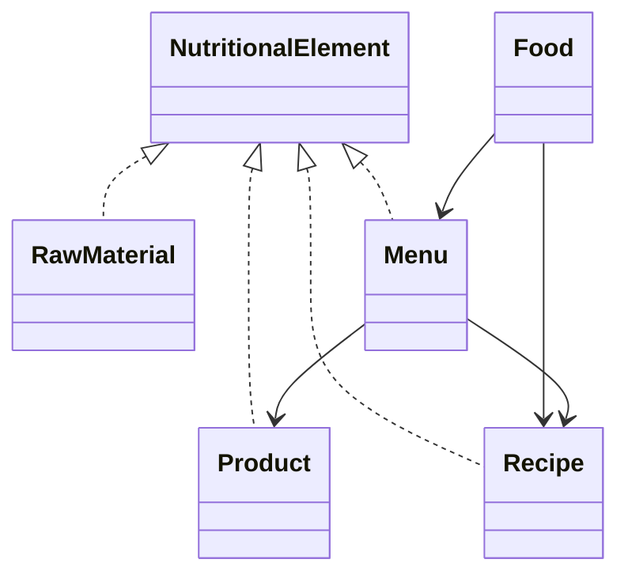
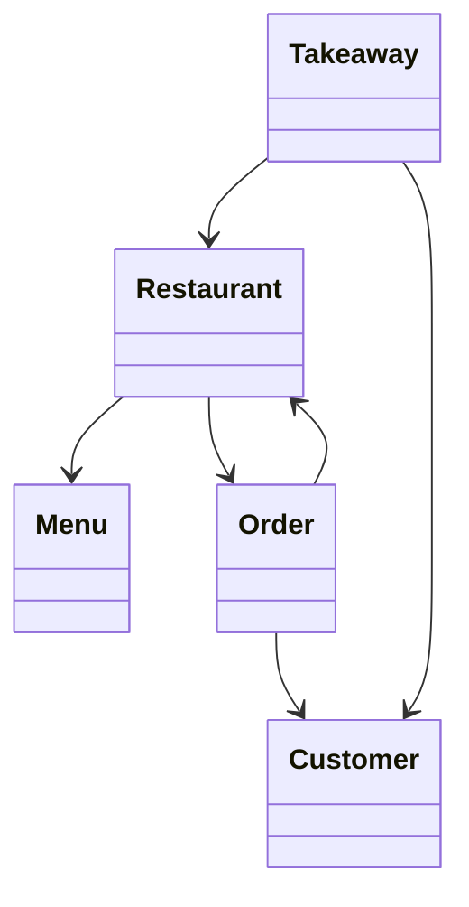
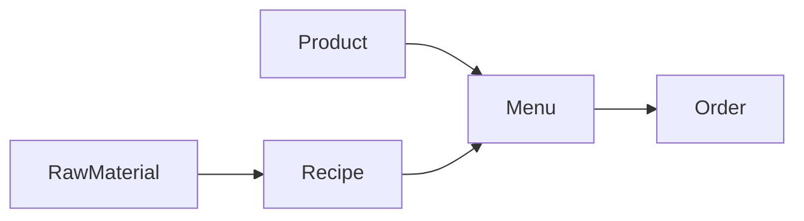
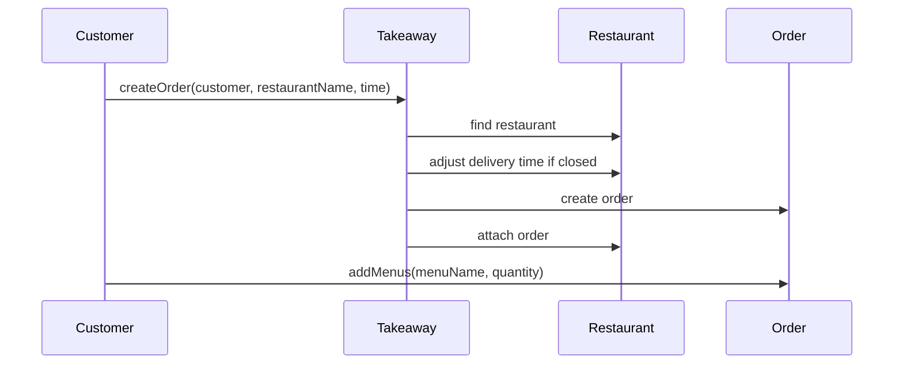

# Architecture

## Overview

This project is a Maven-based Java OOP diet and takeaway management system. It keeps the original lab-style public API while completing the model behind it.

The system has two main facades:

- `Food`: manages raw materials, products, recipes, and menus.
- `Takeaway`: manages restaurants, customers, opening hours, and orders.

## Diet model



`NutritionalElement` is the common abstraction for anything that has calories, proteins, carbohydrates, and fat.

Raw materials are defined per 100 grams. Products are defined per package or serving. Recipes normalize their values per 100 grams. Menus calculate total values for the whole menu.

## Takeaway model



`Takeaway` creates and stores restaurants and customers. `Restaurant` owns its menu catalog, opening intervals, and associated orders. `Order` stores its customer, restaurant, adjusted delivery time, status, payment method, and menu quantities.

## Nutritional calculation flow



Recipe formula:

```text
ingredient contribution = raw material value per 100g * ingredient grams / 100
recipe value per 100g = total contribution / total recipe weight * 100
```

Menu formula:

```text
recipe contribution = recipe value per 100g * menu grams / 100
product contribution = product value per unit
menu total = sum of all recipe and product contributions
```

## Opening-hour logic

Restaurants store opening intervals as start/end time pairs. A restaurant is open when a time is inside `[start, end)`.

Intervals that cross midnight are supported. For example, `22:00` to `02:00` is open from `22:00` through the end of the day and from midnight to `02:00`.

## Order workflow



If a requested delivery time is outside restaurant hours, it is adjusted to the next opening time. If no later opening interval exists on the same day, it uses the first opening interval of the day.
