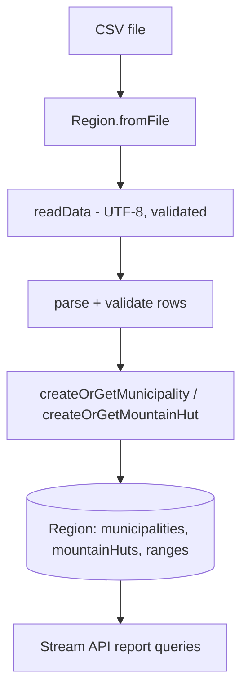
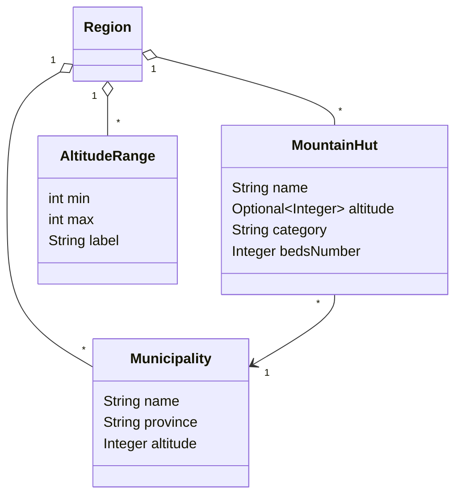

# Architecture

## Overview

`Region` is the aggregate/root object. It owns the altitude-range definitions and the
collections of `Municipality` and `MountainHut`, imports data from CSV, and answers Stream-API
report queries.

## Domain model

- **Region** — facade/aggregate. Validates the region name; de-duplicates municipalities and huts
  by name (`createOrGet...` returns the existing object); exposes defensive, sorted collections and
  report maps ordered by key.
- **Municipality** — immutable (`name`, `province`, `altitude`), fields trimmed and validated.
- **MountainHut** — immutable; altitude is optional (`Optional<Integer>`); other fields validated.
- **AltitudeRange** — immutable range parsed from `"min-max"`; membership is **left-open,
  right-closed** (`min < altitude <= max`), matching the specification.

## CSV import flow

`Region.fromFile(name, path)` calls `readData` (UTF-8, `Files.newBufferedReader`, try-with-resources)
which validates the path/existence and throws `IllegalArgumentException` (cause preserved) on I/O
errors instead of silently returning empty data. Each data row (semicolon-separated, 7 fields:
`Province;Municipality;MunicipalityAltitude;Name;Altitude;Category;BedsNumber`) is validated with
row-numbered error messages; the hut `Altitude` field may be empty.

## Reporting flow

Report queries use the Stream API `groupingBy`/`counting`/`summingInt`/`maxBy` collectors, materialised
into `TreeMap`s so output is deterministic (ordered by province, municipality, range label, or count).
Altitude-range classification uses the hut altitude when present, otherwise the municipality altitude.

## Validation approach

Invalid input throws `IllegalArgumentException` with a clear message. Entities validate in their
constructors (non-blank required strings, non-negative altitudes/beds, non-null municipality); the CSV
importer adds row/field context. Returned collections are unmodifiable defensive copies.
