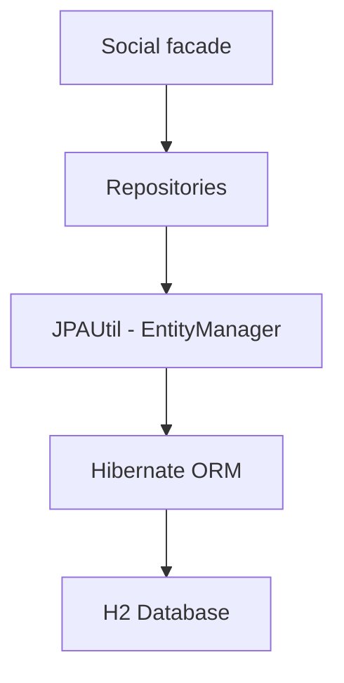

# Social Network Backend

A Maven-based Java backend for a small social network, built on **JPA/Hibernate** over an **H2**
database with a **facade API** and the **repository pattern**. It manages people, bidirectional
friendships, groups and memberships, and posts with **JPQL-paginated** feeds.

> Educational/portfolio project — it runs entirely locally on H2 and has no REST API, UI, or
> authentication (see [Known Limitations](#known-limitations)).

## Features

- People (accounts) with unique codes and duplicate detection
- **Bidirectional friendships** (symmetric, idempotent, self-friendship rejected)
- **Groups** and memberships, with safe rename and deletion that keeps the join table consistent
- **Posts** with author/timestamp and **JPQL pagination** (user feed and friends feed)
- Simple statistics (most friends / largest group / most groups) with deterministic tie-breaking
- Consistent input validation and a small custom exception hierarchy

## Tech Stack

Java 21 · Maven (wrapper) · Jakarta Persistence · Hibernate ORM 6 · H2 · JUnit 5 · JaCoCo · GitHub Actions.

## Architecture



Details: [`docs/ARCHITECTURE.md`](docs/ARCHITECTURE.md),
[`docs/DESIGN_DECISIONS.md`](docs/DESIGN_DECISIONS.md), [`docs/TESTING.md`](docs/TESTING.md).

## Requirements

- **Java 21** (`maven.compiler.release = 21`).
- **Maven 3.9+**, or use the bundled wrapper (`mvnw` / `mvnw.cmd`).

## Build and Test

```bash
./mvnw clean test          # Linux/macOS/Git Bash  (or: mvn clean test)
bash scripts/test.sh
```

```powershell
.\mvnw.cmd clean test      # Windows PowerShell    (or: mvn clean test)
.\scripts\test.ps1
```

Coverage: `./mvnw clean test jacoco:report` → `target/site/jacoco/index.html` (not committed).

## Project Structure

```
project/
├── pom.xml, mvnw, mvnw.cmd, .mvn/         # build + Maven wrapper
├── .github/workflows/java-ci.yml          # CI
├── scripts/                               # test.sh / test.ps1
├── docs/                                  # architecture, testing, decisions, final review
├── resources/META-INF/persistence.xml     # JPA persistence units (socialPU, socialPUTest)
├── src/social/                            # Social (facade), Person, Group, Post,
│                                          # GenericRepository + Person/Group/PostRepository,
│                                          # JPAUtil, ValidationUtils, exceptions
└── test/                                  # example/ (professor test) + custom/ (added tests)
```

## Persistence Notes

- H2 is used both locally (`socialPU`, file-based) and for tests (`socialPUTest`, in-memory,
  `create-drop`). `JPAUtil.setTestMode()` selects the test unit; tests reset the schema between runs.

## Known Limitations

- Educational/local project — **not production-ready**; H2 only, no external datastore/deployment.
- No REST API, no UI, no authentication, no external services.

## Resume Value

Demonstrates a layered JPA/Hibernate backend: facade + repository patterns, entity relationships
(self-referential friendships, many-to-many memberships, one-to-many posts), JPQL pagination,
validation, and an automated JUnit test suite with CI and coverage.

---

## Requirements specification (lab)

(the Italian version is available in file [`README_it.md`](README_it.md)).

Develop an application to support a social network. All classes must be
in the package `social`.

The system must use Hibernate ORM to enable persistence of the information.
To enable proper testing, the class `JPAUtil` must be used to retrieve the `EntityManager` 
objects via the `getEntityManager()` method.

---

## R1 - Subscription

The interaction with the system is made using class `Social`.

You can register a new account using the method `addPerson()` which receives
as parameters a unique code, name and surname.

The method throws the exception `PersonExistsException` if the code
passed is already associated with a subscription.

The method `getPerson()` returns a string containing code, name and
surname of the person, in order, separated by blanks. If the code,
passed as a parameter, does not match any person, the method throws the
exception `NoSuchCodeException`.

**💡 Hint**:

- use the `Person` class (already provided) to represent the person
- use the *repository* pattern (already provided)
    - a `PersonRepository` class that provides the basic ORM-related operations
    - a `personRepository` object in the facade class that wraps the collection of Person objects

## R2 - Friends

Any person, registered in the social, should have the possibility to add
friends. Friendship is bidirectional: if person A is a friend of a person
B, that means that person B is a friend of person A.

Friendship is created using method `addFriendship()` that receives as arguments the
codes of both persons. The method throws the exception `NoSuchCodeException`
if one or both codes do not exist.

Method `listOfFriends()` receives as argument the code of a person and
returns the collection of his/her friends. The exception
`NoSuchCodeException` is thrown if the code does not exist. If a
person has no friends, an empty collection is returned.


## R3 - Groups

It is possible to register a new group using method `addGroup()`. The name of the group must be unique. A `GroupExistsException` is thrown if the group name already exists.

The `updateGroupName()` method allows modifying the name of an existing group. It takes as parameters the current name of the group and the new desired name. A `GroupExistsException` is thrown if the new group name already exists, and a `NoSuchCodeException` is thrown if the current group name does not exist.

The `deleteGroup()` method allows deleting an existing group. It takes the name of the group as a parameter. A `NoSuchCodeException` is thrown if the group name does not exist.

The method `listOfGroups()` returns the name list names of all
registered groups. If there are no groups in the list, the method should
return an empty collection.

A person can subscribe to a group through the method `addPersonToGroup()`
that receives as arguments the code of the person and the name of the
group. In case the code of the person, or the name of the group are
not found a `NoSuchCodeException` is thrown.

Method `listOfPeopleInGroup()` returns the collection codes for the people
subscribed to a given group. It returns and empty collection if the group does not exist.

## R4 - Statistics

Method `personWithLargestNumberOfFriends()` returns the code of a person
that has the largest number of friends (first level). Do not consider the
case of ties.

Method `largestGroup()` returns the name of the group with the largest number
of members. Do not consider the case of ties.

Method `personInLargestNumberOfGroups()` returns the code of a person that
is subscribed to the largest number of groups. Do not consider the case of
ties.

## R5 - Posts

It is possible to add a new post by a given account using the method `post()`
that accepts as arguments the unique code of the person posting, and the text content.
The method returns a unique id for the post containing digits and letters only.

Given a post id it is possible to get:

- the timestamp with `getTimestamp()`,
- the text content with `getPostContent()`.

The timestamp of the post is the current system time at the moment of the post's
creation (retrieved through `System.currentTimeMillis()`).

The paginated list of all posts from _a given user_, excluding the user's own posts, can be retrieved using the method
`getPaginatedUserPosts()` that accepts the user id, the page number (1 is the first)
and the page length. The method returns the ids of the posts sorted by
descending timestamp. The list is split into pages, each containing a
number of posts specified by the page length.
E.g., if page length is 5 and page is 2, then posts with position 6 to 10 are returned.
Post are sorted by descending timestamp, i.e., the most recent first.

The paginated list of all posts from _the friends of a given user_ be retrieved using the method
`getPaginatedFriendPosts()` that accepts the user id, the page number (1 is the first)
and the page length. The method works like the previous one, but it returns in the list both
the author code and the post id, separated by `":"`.
