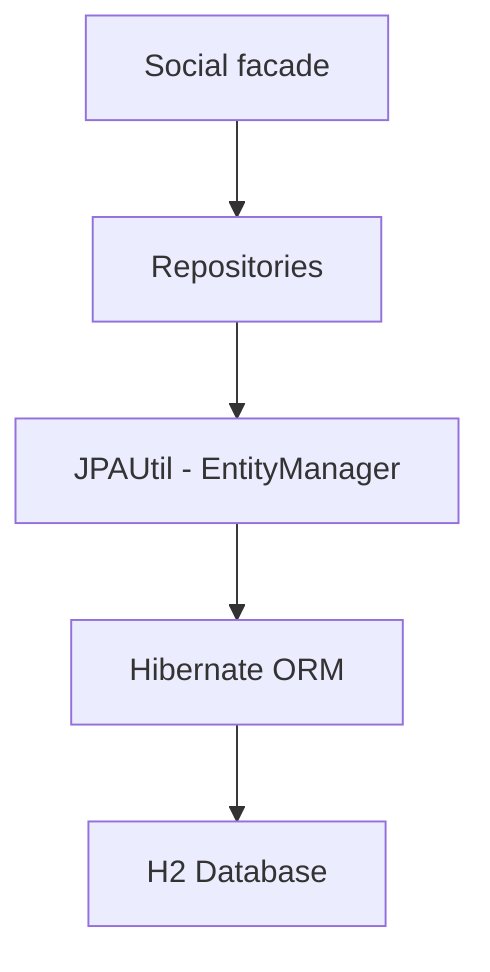
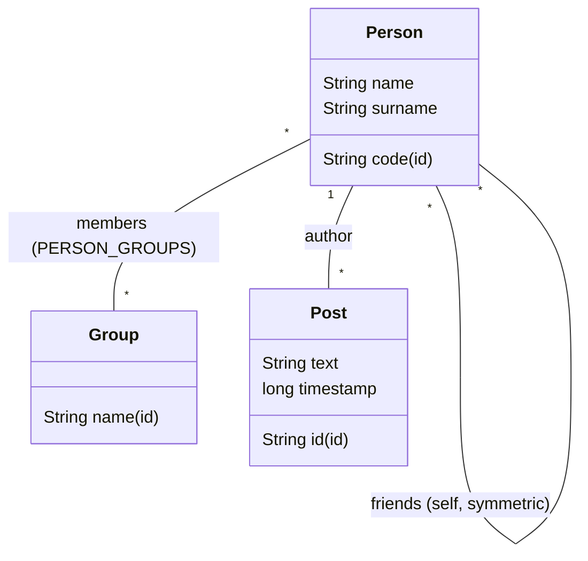
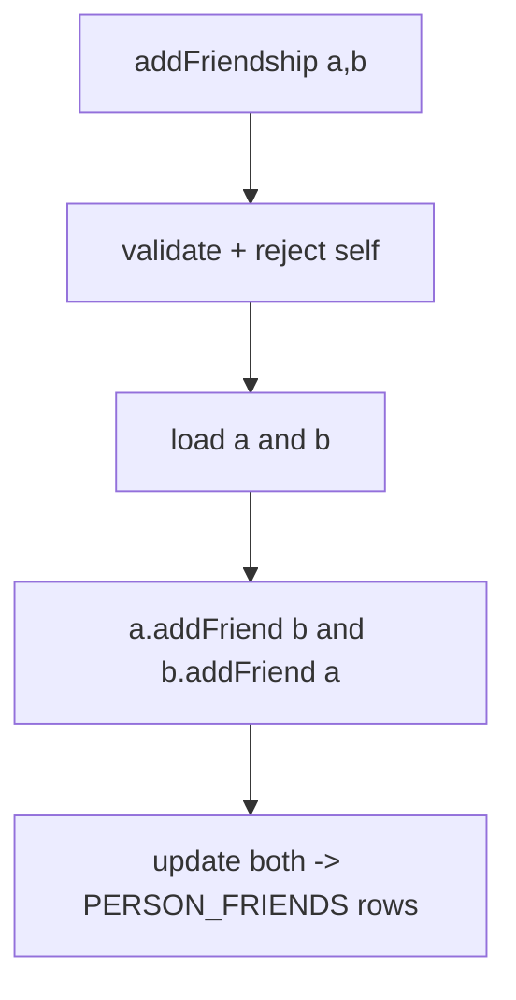
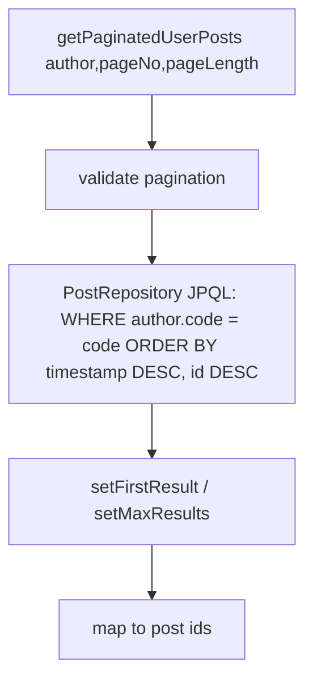

# Architecture

## Layers

- **Facade (`Social`)** — the single public entry point. It validates input, coordinates
  transactions/contexts through `JPAUtil`, applies business rules (friendships, groups, posts,
  statistics), and returns defensive, deterministically-ordered collections.
- **Repositories** — `GenericRepository<E, I>` provides CRUD (`findById`, `findAll`, `save`,
  `update`, `delete`); `PersonRepository`, `GroupRepository`, and `PostRepository` specialise it.
  `PostRepository` adds JPQL pagination queries.
- **Persistence (`JPAUtil`)** — manages a single `EntityManagerFactory` and a thread-local
  `EntityManager`, and exposes `withEntityManager`, `transaction`, `executeInTransaction`, and
  `executeInContext` helpers. `setTestMode()` selects the in-memory test persistence unit.
- **Hibernate / H2** — the JPA provider and database.

## Entities

- **Person** — id `code`; `name`/`surname` non-null. Self-referential many-to-many `friends`
  (join table `PERSON_FRIENDS`, kept symmetric by the facade). Many-to-many `groups` (owning side,
  join table `PERSON_GROUPS`). One-to-many `posts` (inverse of `Post.author`).
- **Group** — id `name`; members are the inverse side (`mappedBy = "groups"`). Table `SocialGroup`
  (`GROUP` is a reserved SQL word).
- **Post** — id (caller-supplied UUID hex); non-null `text`, `timestamp`; mandatory `author`
  (`@ManyToOne(optional=false)`). Indexed on `author_code`, `post_timestamp`, and the pair.

## Data flows

Friendship (transactional, symmetric):

Post pagination (JPQL, database-side):

The friends feed uses `WHERE p.author IN (SELECT f FROM Person pr JOIN pr.friends f WHERE pr.code = :code)`
and returns `authorCode:postId` entries.

## Testing strategy

The professor test (`test/example/TestExample`) validates the R1–R5 contract. Custom tests
(`test/custom`) reset the in-memory schema before each test and cover people/friendships, groups,
posts/pagination, statistics, and an end-to-end workflow. See [`TESTING.md`](TESTING.md).
