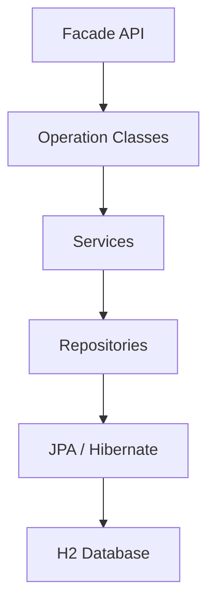
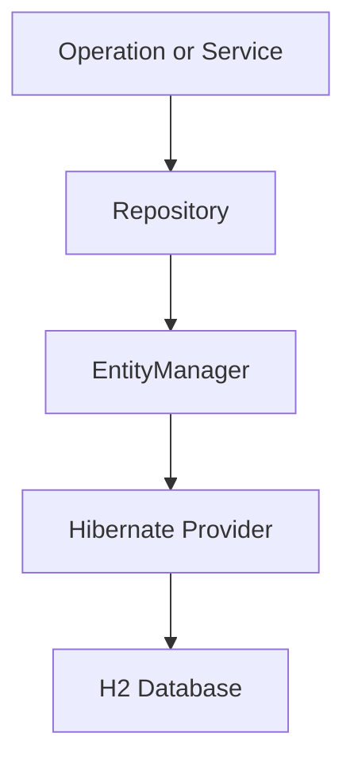
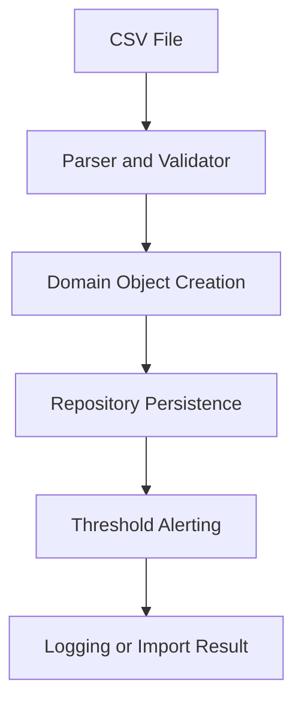
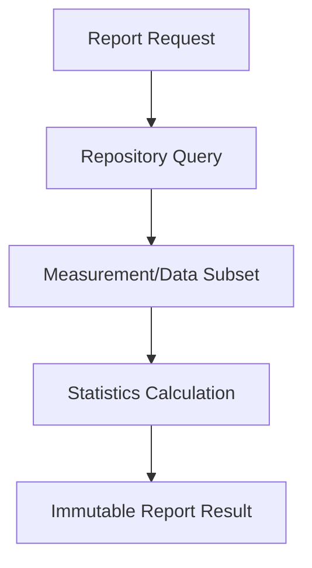

# Architecture

## 1. High-level architecture

The system is a layered Java backend. Callers use a single `WeatherReport` facade, which delegates to
operation interfaces; operations use services and repositories; repositories talk to JPA/Hibernate over
an H2 database.

## 2. Facade layer

`WeatherReport` is the entry point. It exposes `networks()`, `gateways()`, `sensors()`, `topology()`
(returning the corresponding `*Operations` interfaces) plus `importDataFromFile(...)` and
`createUser(...)`. `OperationsFactory` supplies the concrete operation implementations, so callers
depend only on interfaces.

## 3. Operation / service layer

- **Operations** (`NetworkOperationsImpl`, `GatewayOperationsImplements`, `SensorOperationsImplement`,
  `TopologyOperationsImpl`) hold authorization (maintainer checks), input/code validation, CRUD
  orchestration, and report construction.
- **Services** (`DataImportingService`, `AlertingService`) hold cross-cutting behavior: CSV import and
  threshold-violation notifications.

## 4. Repository layer

- `CRUDRepository<T, ID>` — generic create/read/read-all/update/delete, one `EntityManager` per
  operation (closed in `finally`), transactions with rollback on failure.
- `MeasurementRepository` — JPQL/`TypedQuery` finders by sensor/gateway/network code and inclusive
  timestamp range, plus `count*` aggregates. Named parameters only; the JPQL field name is always a
  fixed literal, never caller input.

## 5. Persistence layer

`PersistenceManager` owns a single cached `EntityManagerFactory`. `persistence.xml` defines two units:
`weatherReportPU` (runtime/dev default) and `weatherReportTestPU` (tests, selected via `setTestMode()`).
Both are H2 in-memory.

## 6. Entity relationship overview

- `Network` 1—* `Gateway` (`gateway.network`), `Network` *—* `Operator` (join table).
- `Gateway` 1—* `Parameter` (cascade/orphan-removal), `Gateway` 1—* `Sensor` (`sensor.gateway`).
- `Sensor` embeds a `Threshold` (value + type).
- `Measurement` stores denormalized `networkCode`/`gatewayCode`/`sensorCode` strings + value +
  timestamp (indexed for range queries). `User` has a username + role. Most entities carry audit
  metadata via `Timestamped`.

## 7. Data import flow

The file path is resolved robustly (tolerating percent-encoded paths), read as UTF-8 with
try-with-resources; each row is parsed (`CsvUtils`), validated, and — if valid — persisted, after which
`checkMeasurement` may raise a threshold alert. Malformed rows are skipped and recorded in
`ImportResult` (partial import).

## 8. Reporting flow

Reports fetch only their measurement subset via the repository date-range queries (no full-table
read-and-filter), compute statistics/histograms, and expose read-only collections.

## 9. Testing strategy

Professor **base tests** (`test/base`, requirements R0–R4) validate the public contract; **custom
tests** (`test/custom`) cover repository queries, statistics edge cases, CSV/import, date/validation,
threshold alerting, authorization, topology/deletion, persistence configuration, immutability, and an
end-to-end workflow. Each test runs against a fresh in-memory schema (`setTestMode()` + teardown). See
[`TESTING.md`](TESTING.md).

## 10. Design trade-offs

See [`DECISIONS.md`](DECISIONS.md). In short: denormalized `Measurement` codes (simple, no joins, but
no referential integrity); sample variance and `>= 2σ` outliers per spec; percentage load ratios;
partial CSV import; H2 in-memory only; and a per-row sensor scan in `checkMeasurement` kept because the
professor tests mock repository construction and require that structure.
